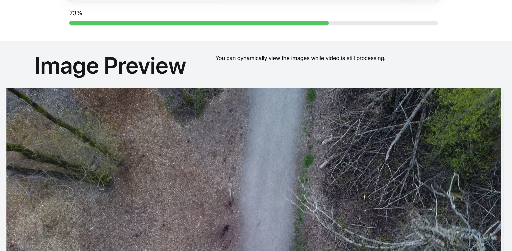
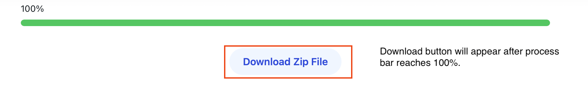

# User Guide
Step1: Click on the Choose file button to select a vdieo file to upload for drone footage review

Step2: Once you have chosen the video file, you can click on the play button to preview it to see if it is the video you want to upload. 

Step3: After confirming the video, you can click Upload button to upload the video to our server, waiting to be reviewed.

Step4: Once the process bar is moving, it means our server is now processing your video. You will receive instant feedback when we find any footages and it will appear in your Preview section.

Step5: Once the process bar reached 100%, it means the video processing is finished. A download button will appear and you can click the download button to download all the footages.

Repeat the previous steps if you want to upload a new video for reviewing.